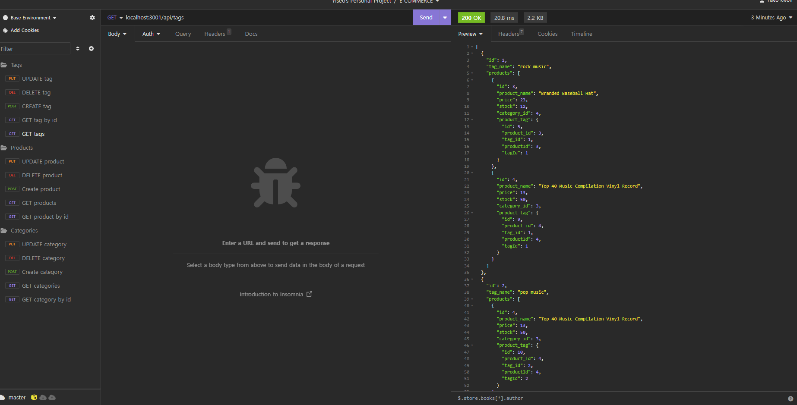

# E-commerce-backend
 

## Description
This project was created to build the back end for an e-commerce site using Express.js API configured to use Sequelize to interact with a MySQL database

## Technologies
- Node.js
- Express.js
- Sequelize
- MySQL2
- Dotenv

## Installation
To run this application locally, follow these steps:

1. Clone this repository to your local machine
2. Navigate to the repository's root directory in your terminal
3. Run `npm install` to install the required dependencies
4. Configure the database connection in the `.env` file
5. Create the necessary database by entering the MySQL shell and running: `source db/schema.sql`
6. Exit the MySQL shell and seed the database with initial data using: `npm run seed`
7. Start application by running: `node server.js`

## Usage
1. Open your terminal.
2. Navigate to the repository's root directory.
3. Start the server with the following command: ```npm run start```

## License
This project is licensed under the MIT license - see the [MIT License](https://opensource.org/licenses/MIT) file for details.

## Screenshot


## Walkthrough Video
[GET routes: https://watch.screencastify.com/v/7xb7l62z1WB9MnOzJKrB](https://watch.screencastify.com/v/7xb7l62z1WB9MnOzJKrB)

[POST, PUT, DELETE tag: https://watch.screencastify.com/v/R04tu5xAqM0hn8NLUjBp](https://watch.screencastify.com/v/R04tu5xAqM0hn8NLUjBp)

[POST, PUT, DELETE product, category: https://watch.screencastify.com/v/8EnIIhBSSzgBC247aPJF](https://watch.screencastify.com/v/8EnIIhBSSzgBC247aPJF)